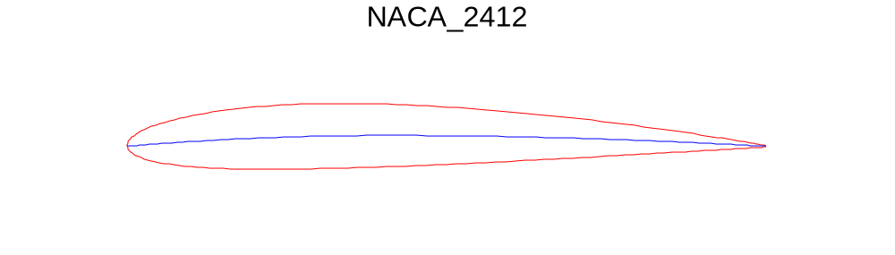

# rfoil

A pure rust crate aimed at generating, fetching and manipulating airfoil data.

## rfoil is in early developement

## Working features

* NACA 4-digit generation
* Airfoil plotting

## Features to be implemented :

* Generate naca airfoils
* Output graph of airfoil data and shape
* Fetch airfoil data from the internet  
* Perform some basic calculation and give key performance figures for any airfoil
